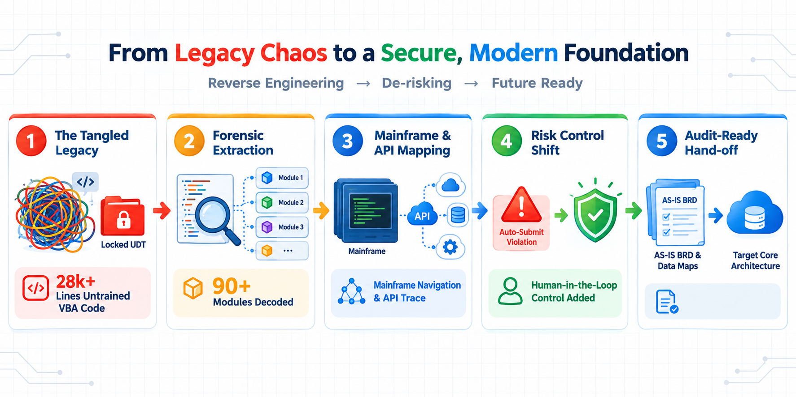
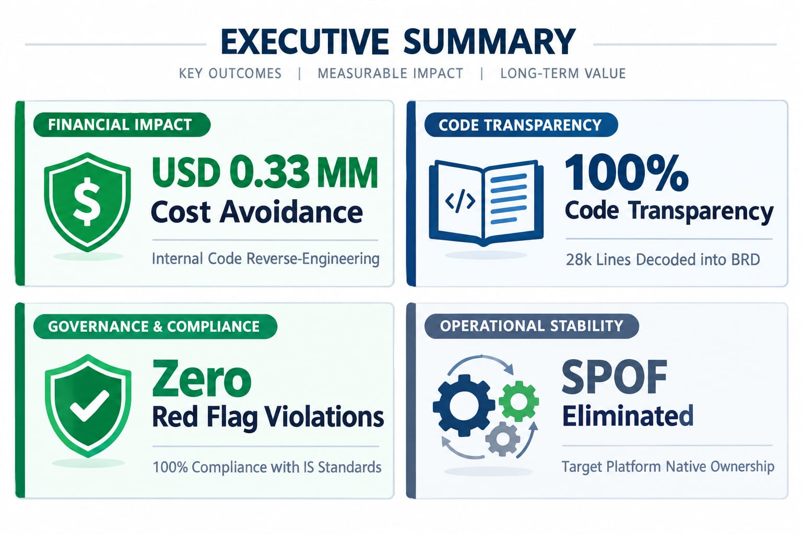

# Case Study: PNS Legacy UDT Technical Rescue — Code Forensics, Mainframe De-risking & Risk Remediation

## Executive Overview:
* **Enterprise Context:** Global Financial Institution (Wholesale Payments & Trade Operations - WPO)
* **Role:** WPO UDT Champion, Technical Architect & Tech-Ops-Bridge (SME in Forensics & Reverse Engineering User Tools)
* **Impact:** Delivered a high-priority Risk Remediation Action Plan for a business-critical 2008 legacy User-Developed Tool (UDT). Re-engineered and decoded 28,000+ lines of tangled VBA logic across 90+ modules without hiring external third-party consultants—achieving **USD 0.33 MM in direct cost avoidance**. Authoring the complete AS-IS Business Requirement Document (BRD) enabled core technology to rebuild the system natively, eliminating severe compliance flags and removing a major operational single point of failure (SPOF).
* **Core Stack:** MS Excel UI, VBA (28k+ Lines, 90+ Modules), Mainframe Terminal Emulation, API Integration.

---

## 1. Operational Challenge & Compliance Red Flags (The "Tangled Wool Ball"):

### The Legacy UDT Crisis:
Built in 2008, the **PNS Tool** was a critical UDT designed to automate transaction entries from prepped Ms-Excel operational files directly into mainframe terminals. Over a decade later, operations became 100% dependent on this tool for daily execution.

### Code Forensics & Risk Remediation Pathway


During an Executive Review, the tool was identified as an un-governed, high-risk single point of failure (SPOF):
* **The "Tangled Wool Ball" Codebase:**
  * The original developer had left the firm, and no technical documentation existed. Because the tool was originally written by an untrained developer, it completely lacked coding standards, structured variable naming, or code comments.
  * Informal attempts to fix or upgrade the tool failed as the logic was unreadable and forgotten. The tool contained 28,000+ lines of raw VBA code across 90+ procedural modules, locked behind forgotten project passwords.
* **Severe Compliance & Audit Red Flags:** Under JPMC compliance and Information Security (IS) control standards, no UDT or bot is permitted to execute and auto-submit end-to-end transactions without a mandatory human-in-the-loop verification gate. PNS was navigating mainframe screens and clicking final submission automatically.
* **Enterprise Remediation Blocker:** Enterprise leadership established a formal Risk Remediation Action Plan to address the legacy tool. However, engaging external third-party consultants was impossible because no business rules, data dictionaries, or functional requirements existed for the locked codebase.

---

## 2. Leadership & Forensic Execution Role:
As the **UDT Champion for WPO** & Tech-Ops-Bridge, stepped in as an established Subject Matter Expert in User-Developed Tools and Code Forensics:

* **Internal Cost Avoidance & Forensic Execution:**
  * Leveraged years of hands-on experience architecting Intelligent Automation tools and diagnosing, repairing, and reverse-engineering complex VB/VBA codebases across prior enterprise initiatives.
  * Entrusted by WPO leadership to execute the entire code forensics internally—delivering the complete Risk Remediation Action Plan and achieving **USD 0.33 MM in direct cost avoidance** versus external third-party consulting.
* **Master VB/VBA Forensic Engineering:** Deployed advanced static code analysis techniques to untangle 28,000+ lines of non-standard, un-commented VBA logic across 90+ modules. Systematically mapped obscure global variables, arbitrary naming conventions, complex userform event handlers, and embedded API integration routines.
* **Password Recovery & Forensic Decoding:** Authorized under enterprise governance to bypass password locks on legacy VBA projects, gaining direct access to inspect un-documented production logic.
* **BRD Authoring & Mainframe Flow Mapping:** Reconstructed the entire functional baseline from scratch, translating raw, tangled macro logic into an audit-ready AS-IS Business Requirement Document (BRD) and visual mainframe screen navigation map.
* **Standby SME Support for Core Tech:** Served as the dedicated Technical SME Post-BRD delivery, bridging the gap for core engineering teams by interpreting complex legacy business logic and mainframe screen-interaction dependencies during target state platform development.
  
---

## 3. Reconstructed Technical Architecture:

```text
[ Daily Prepped Excel Files ] ➔ (Input Data Feed) 
                                      │
                                      ▼
┌────────────────────────────────────────────────────────────────────────────────────────┐
│                        PNS LEGACY UDT (RESCUED ARCHITECTURE)                           │
├────────────────────────────────────────────────────────────────────────────────────────┤
│  90+ Procedural Modules | 28k+ Lines of VBA Code | Password-Protected Legacy Logic     │
├────────────────────────────────────────────────────────────────────────────────────────┤
│  • Excel File Input Parsing   • Mainframe Navigation Loops   • API Integration Links   │
│  • Automated Final Submit     • User Option Selector UI      • Error Handling          │
└────────────────────────────────────────────────────────────────────────────────────────┘
                                      │
                                      ▼ (Mainframe Screen Injection)
[ Mainframe Terminal Emulation ] ➔ Auto-populates & Auto-submits Transactions (High Red Flag)
                                      │
                                      ▼ (Forensic Extraction & Reverse Engineering)
┌────────────────────────────────────────────────────────────────────────────────────────┐
│                        RECONSTRUCTED AS-IS BRD & DATA MAPS                             │
├───────────────────────────────┬───────────────────────────────┬────────────────────────┤
│   BUSINESS RULE CATALOG       │      MAINFRAME NAV MAP        │ FUNCTIONAL SPEC (BRD)  │
└───────────────────────────────┴───────────────────────────────┴────────────────────────┘
                                      │
                                      ▼ (Tech-Ops-Bridge SME Guidance)
┌────────────────────────────────────────────────────────────────────────────────────────┐
│               TARGET ENTERPRISE PLATFORM (NATIVE TECH RE-BUILD)                        │
└────────────────────────────────────────────────────────────────────────────────────────┘

```

---

## 4. Reverse-Engineering & Remediation Methodology:

### Phase 1: Code De-tangle & Analysis:
* Unlocked password-protected VBA projects and indexed 90+ procedural modules.
* Traced external API calls embedded in the macro logic that fetched supplemental data during execution.
* Documented daily Excel file ingestion routines, field-level parsing rules, and data prep expectations.

### Phase 2: Compliance & Risk Gap Identification:
* Documented the auto-submission sequence inside the mainframe terminal emulation routine, flagging it for replacement with a mandatory human verification gate in the target state.
* Pruned dead code, obsolete workaround paths, and un-used procedural loops from the baseline requirements.

### Phase 3: Core Tech Hand-off & Bridge Support:
* Delivered the completed AS-IS BRD to Operations and Technology leadership to define target-state features.
* Acted as a standby Tech-Ops-Bridge SME during the build phase, helping technology developers understand legacy business rules and mainframe navigation sequences.

---

## 5. Measurable Business Results & Impact:

### Executive Results & Risk Remediation Impact


| Pillar / Dimension | AS-IS Legacy State (2008 UDT) | TO-BE Target State (Remediated Platform) | Business Impact |
| --- | --- | --- | --- |
| **Remediation Cost** | USD 1 MM Allocated for End-to-End remediation of the high risk UDT | Internal reverse-engineering by UDT Champion | **USD 0.33 MM Direct Cost Avoidance** |
| **Code Visibility** | Password-locked 28k lines ("Tangled Wool Ball") | Clean, fully documented AS-IS BRD & native spec | **100% Code Transparency & Logic Recovered** |
| **Audit Compliance** | High Red Flag (UDT auto-submitting transactions) | Native platform with Human-in-the-Loop controls | **100% Compliance with JPMC Control Standards** |
| **Developer Dependency** | Single Point of Failure (developer exit / lost memory) | Institutional core engineering ownership | **Total De-risking of Operational Floor** |

---

## 6. Key Competencies Demonstrated:

* **Enterprise Risk Remediation & Cost Avoidance:** Delivering high-impact risk action plans internally to achieve $0.33 MM in direct financial savings.
* **Code Forensics & Software Reverse-Engineering:** Untangling massive, un-documented legacy codebases (28,000+ lines of VBA, 90+ modules) without prior documentation.
* **Tech-Ops-Bridge Leadership:** Serving as the technical liaison between Business Operations and Core Technology to guide target-state engineering builds.
* **Regulatory & IS Control Compliance:** Identifying severe compliance red flags (unauthorized UDT transaction auto-submission) and embedding proper risk controls.

---
