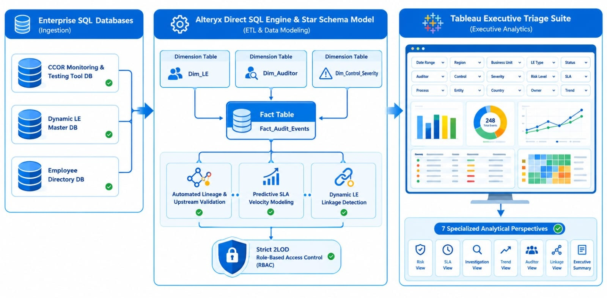
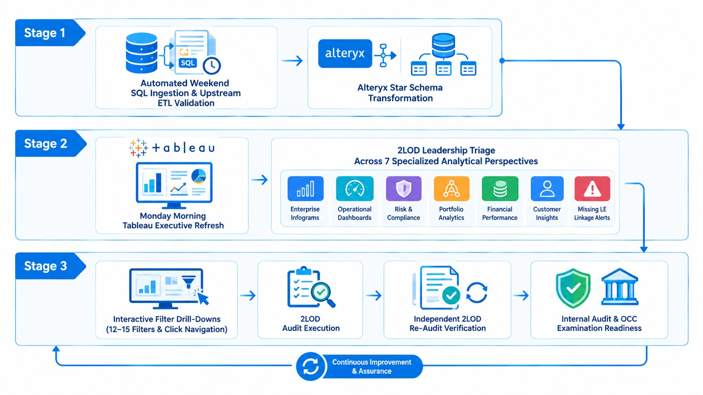

# Case Study: Project 05 — Legal Entity Risk & Control Audit Coverage Engine (2LOD CCOR):

## Executive Overview:
* **Enterprise Context:** Compliance & Operational Risk (CCOR — Second Line of Defence/ 2LOD)
* **Strategic Catalyst:** Sustained multi-year alignment with evolving OCC guidelines, Internal Audit scrutiny, and leadership requirements across dynamic global Legal Entities (LE's) and risk/control framework severities.
* **Role:** Lead Project Manager & Analytics Architect (Alteryx ETL & Governance Lead)
* **Impact:** Spearheaded a 3-year Agile transformation (**~12–15 releases across 2–3 month sprints**) delivering a SQL-driven Alteryx ETL pipeline and Tableau executive triage suite. Embedded statistical data validation, predictive workload risk modelling, missing LE link detection, and independent 2LOD re-audit loops across 7 Curated Analytical Facets — with every release on-boarded to the firmwide Bot/ Tool Inventory under strict SDLC version control.
* **Core Stack:** Alteryx (Direct SQL Ingestion, Automated Data Integrity Validation & Re-Audit Tracking), Tableau (Interactive Executive Analytics & Visual Filtering), Multi-Source SQL Databases (Corporate LE Master DB, CCOR Monitoring & Testing Tool, Employee Directory DB), Predictive Risk Analytics, Enterprise SDLC, Role-Based Access Control (RBAC) & 2LOD Risk Governance.

---

## 1. Operational Challenge & Governance Ecosystem:

### Multi-Tiered Audit Hierarchy & Regulatory Flow:
The enterprise enforces a strict 3-tier audit architecture: First Line of Defence (`1LOD`), Second Line of Defense (`2LOD CCOR Oversight`), and Third Line of Defence (`Internal Auditors`). External regulatory bodies (such as the OCC) evaluate Internal Audit first and dive directly into 2LOD testing artifacts to assess overall control effectiveness. Maintaining uncompromised data lineage, complete LE coverage visibility, and strict access governance was a mandatory enterprise requirement.

### Boundary Management & Data Lineage Defence:
* **Boundary Management:** 1LOD Operations partners joined initial audit scoping discussions to provide operational context and remained engaged through testing and remediation. However, 2LOD operated independently — conducting testing and executing internal re-audits of remediation results before closure.
* **Source System Data Lineage & Upstream Validation:** Partnered with stakeholders to address output data integrity queries, conducting joint walk-throughs of raw data, SQL queries, and Alteryx ETL stages to prove 100% data accuracy and reassure leadership of absolute pipeline fidelity.
  * **Pipeline Transparency:** Mapped end-to-end Alteryx ETL stages to prove raw source fidelity and zero data distortion.
  * **Automated Data Checks:** Embedded automated ETL validation rules to catch and isolate upstream anomalies before dashboard refresh.
  * **Root-Cause Auditing:** Traced data queries directly to raw database tables to validate reporting accuracy against upstream inputs.
  * **Origin Remediation:** Enforced source governance by routing database discrepancies back to origin teams (e.g., Branch Ops) for fix.
* **Strict 2LOD Role-Based Access Control (RBAC):** To safeguard sensitive compliance metrics, the suite was locked down with granular RBAC, ensuring visibility was strictly restricted to authorised 2LOD personnel.

---

## 2. Embedded Data Analytical Modelling & ETL Intelligence:

To move beyond static reporting, we engineered a robust Dimensional Data Model (Star Schema) in Alteryx/ SQL and embedded predictive analytical logic across the pipeline:
* **Dimensional Data Modelling (Star Schema):** Modelled core database feeds into a structured `Fact_Audit_Events` table connected to `Dim_Legal_Entity`, `Dim_Control_Severity`, and `Dim_Auditor` dimensions, ensuring high query performance across 12–15 dynamic filters in Tableau.
* **Predictive SLA & Velocity Modelling:** Integrated time-series velocity algorithms in Alteryx to project estimated completion dates based on historical cycle times, proactively flagging audits likely to breach annual/biennial OCC mandates.
* **Statistical Anomaly & Linkage Scoring:** Applied automated delta-checking logic to detect broken database joins, unmapped LE hierarchies, and abnormal auditor allocation ratios before data reached executive dashboards.
* **Capacity & Risk Concentration Scoring:** Developed weighted scoring logic cross-referencing control severity (High/Med/Low) against auditor bandwidth to highlight operational capacity risks across global regions.

```text
┌────────────────────────────────────────────────────────────────────────────────────────┐
│                        DIRECT SQL QUERIES ACROSS ENTERPRISE DATABASES                  │
├────────────────────────────────────────────────────────────────────────────────────────┤
│  • CCOR Monitoring & Testing Tool DB  • Dynamic LE Master DB  • Employee Directory DB  │
└────────────────────────────────────────────────────────────────────────────────────────┘
                                           │
                                           ▼
┌────────────────────────────────────────────────────────────────────────────────────────┐
│                   ALTERYX ETL PIPELINE & EMBEDDED ANALYTICAL MODELS                    │
├────────────────────────────────────────────────────────────────────────────────────────┤
│  1. Direct SQL Ingestion               2. Source System Data Integrity Validation      │
│  3. Predictive Bottleneck Modelling    4. Dynamic LE Linkage & Anomaly Detection       │
└────────────────────────────────────────────────────────────────────────────────────────┘
                                           │
                                           ▼
┌────────────────────────────────────────────────────────────────────────────────────────┐
│               TABLEAU MONDAY TRIAGE DASHBOARD (STRICT 2LOD RBAC ACCESS)                │
├────────────────────────────────────────────────────────────────────────────────────────┤
│ • 12–15 Top-Level Filters   • Visual Click Drill-Downs   • 7 Curated Analytical Facets │
└────────────────────────────────────────────────────────────────────────────────────────┘

```



---

## 3. The 7 Curated Analytical Facets & Interactive UX:

Designed specifically from the viewpoints of **2LOD Leadership** and **Internal Audit/ Regulatory Reviewers**, the suite features **12–15 top-level filter controls** and **click-sensitive visual drill-downs**:
* **Perspective 1: Enterprise Executive Risk Dashboard (Firmwide Infogram):** Macro-level view for 2LOD Leadership and Internal Audit showing total global LE coverage, overall control health, and high-level OCC mandate compliance.
* **Perspective 2: Regional & Legal Entity (LE) Hierarchy Heatmap:** Dynamic matrix mapping audit status across global LE's and geographic branches, featuring multi-layered visual filters to drill down into High, Medium, and Low severity controls seamlessly.
* **Perspective 3: Audit Lifecycle & Bottleneck Triage:** Executive operational view tracking stage progression (Unassigned, In-Progress, Stuck, Pending Remediation) to drive Monday morning allocation decisions.
* **Perspective 4: 2LOD Independent Re-Audit & Remediation Queue:** Specialised compliance view tracking issues returning from Ops remediating under 1LOD supervision, highlighting active 2LOD re-testing cycles required prior to final sign-off.
* **Perspective 5: Auditor Bandwidth & Capacity Distribution:** Resource management view evaluating auditor allocation, open workload concentration, and productivity metrics across regional teams.
* **Perspective 6: Regulatory Exam & OCC Audit Readiness Pack:** Curated view designed specifically for Internal Audit and OCC examiners, providing end-to-end data lineage, historical completion proof, and sample-testing documentation.
* **Perspective 7: Missing LE Connections & Source Data Integrity Alerts:** Governance view isolating broken database joins, unmapped clients, and incomplete onboarding records for 2LOD escalation to Branch Operations maintenance teams.



---

## 4. Multi-Year Agile SDLC & Firmware Inventory Governance:

* **Sustained Multi-Year Agile Evolution (~12–15 Releases across 2–3 Month Sprints):** Maintained continuous alignment with evolving OCC regulatory guidelines, Internal Audit feedback, and shifting 2LOD leadership priorities over a 3-year period.
* **Complete SDLC & Inventory Registration:** Executed full enterprise SDLC protocols for every single sprint release—including formal Business Requirement Documents (BRD), System Design Documents (SDD), and User Acceptance Testing (UAT) sign-offs.
* **Firmwide Bot & Tool Inventory Onboarding:** Formally registered and maintained every version release on the enterprise Bot/ Tool Inventory, enforcing strict version control, Information Security (IS) reviews, and audit compliance.
* **Tableau UX & Access Security:** Directed a Tableau developer to construct the 7 Interactive & Curated Analytical Facets, build click-sensitive navigation paths, configure 12–15 filter bars, and implement strict 2LOD Role-Based Access Control (RBAC).

---

## 5. Measurable Business Results & Impact:

| 📊 Metric / Dimension | 🛑 Baseline State (Pre-Automation) | 🎯 Post-Deployment State (Project 05 Engine) | 💡 Strategic Value |
| --- | --- | --- | --- |
| **Data Extraction** | Manual flat-file dumps & multi-spreadsheet aggregation | **Direct SQL Ingestion via Alteryx from CCOR Monitoring & Testing Tool** | Automated, error-free data pipeline with zero manual manipulation |
| **Data Quality Defence** | Stakeholder friction over output accuracy | **Embedded Upstream Validation & Lineage Transparency** | Proves analytics integrity and routes source data fixes back to origin systems |
| **Analytical Intelligence** | Static, historical reporting | **Predictive Bottleneck & Workload Risk Modelling** | Proactively flags potential SLA breaches and capacity constraints |
| **Governance Independence** | Unclear remediation validation boundaries | **Automated 2LOD Re-Audit Lifecycle Tracking** | Ensures 2LOD independently audits and verifies remediation results |
| **Agile SDLC Alignment** | Ad-hoc, unmaintained reporting tools | **~12–15 Sprints On-boarded to Firmwide Tool Inventory** | Sustained multi-year alignment with evolving OCC guidelines and SDLC controls |
| **User Experience & UX** | Static, rigid PDF/Excel reports | **12–15 Dynamic Filters & Click-Sensitive Drill-Downs** | Serves entry-level auditors, 2LOD leads, Internal Audit, and OCC examiners across 7 cuts |

---

## 6. Key Competencies Demonstrated:

* **2LOD Risk & Compliance Architecture:** Translating multi-tier audit structures (1LOD, 2LOD, Internal Audit, OCC) and independent re-audit workflows into systematic data logic.
* **Multi-Year Agile Product Management (~12–15 Releases):** Driving sustained, sprint-based releases with complete SDLC compliance and firmwide Tool Inventory onboarding.
* **Advanced Data Engineering & Analytical Modelling:** Integrating predictive bottleneck models, anomaly scoring, and dynamic SQL ETL pipelines in Alteryx directly connected to the CCOR Monitoring & Testing Tool.
* **Executive Visualisation & Security Architecture:** Designing multi-persona Tableau suites (7 Facets, 12–15 filters, click-navigation) protected by strict 2LOD Role-Based Access Control.

---

